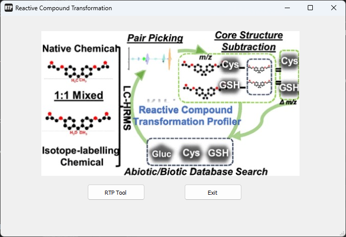
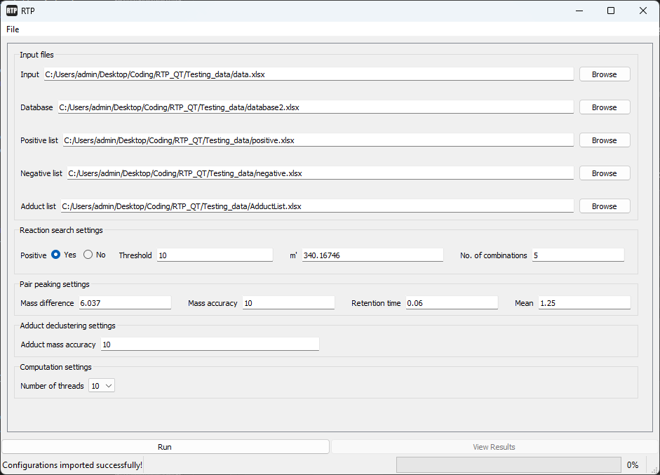
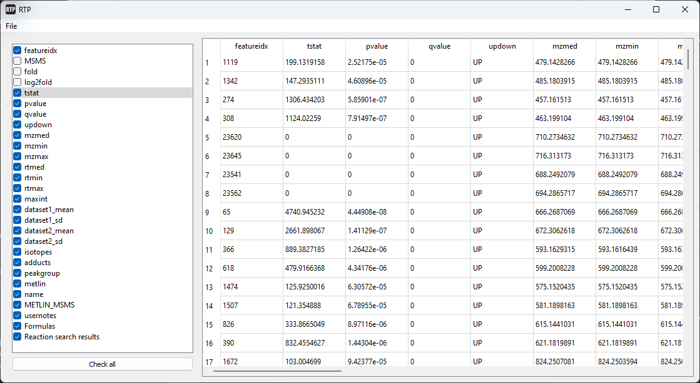
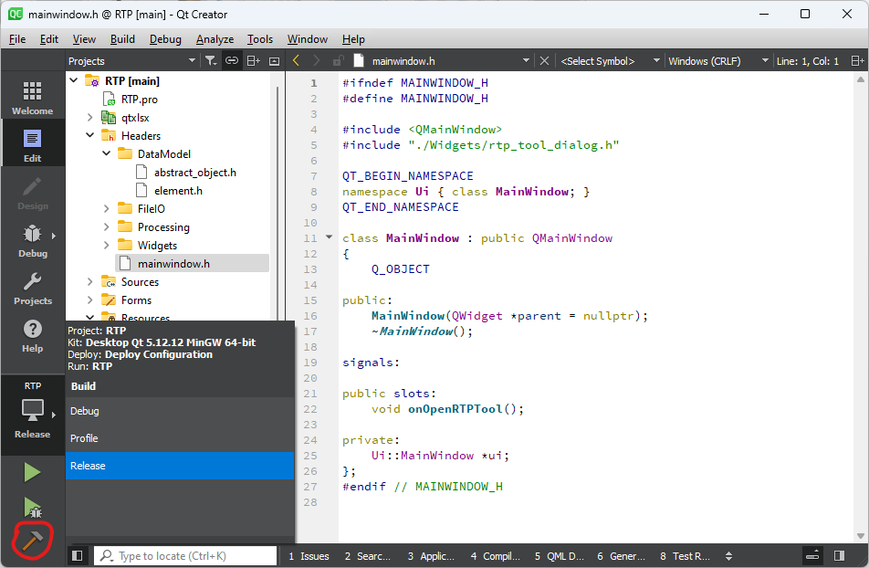

# **RTP**: Reactive Compound Transformation Profiler
This is an interactive tool of the RTP paper. This tool is programmed in C++ and the interface is desgined with QT Creator 5.0.2. The following of this article will introduce how to use this tool.

## Original paper

Liu, M., Jiang, J., Zheng, J., Huan, T., Gao, B., Fei, X., ... & Fang, M. (2021). RTP: one effective platform to probe reactive compound transformation products and its applications for a reactive plasticizer BADGE. *Environmental Science & Technology*, 55(23), 16034-16043.

## How to launch this application?
Our application is available on both Windows and MacOS. Of course, you can download the source codes and build your own version on other platforms like Linux. Later we will explain how to build the source codes.

After you download this application, please unzip it and double-click the executable file directly. It has integrated all the necessary libraries so you don't have to install any other software or libraries. 

## User interface
On you open the application, you will see the main window with a picture briefly showing the workflow of the RTP method. You will also see an "RTP tool" button and an "Exit" button. 

## RTP tool - how to run the algorithm?
On you click the "RTP button", a new dialog will pop up for you to run the RTP method. The dialog consists of several input sections and two buttons. Below is a list of the inputs you need to provide for the algorithm:

1. Input files. You can input the file paths in the text boxes, or paste from elsewhere, or use the browse buttons.
   - Input (your raw data).
   - Database
   - Positive list
   - Negative list
   - Adduct list

    Note this tool currently only supports .xlsx files. Please make sure every .xlsx file only has one single sheet.
2. Reaction search settings
   - Positive (Yes or no). If "Yes", it uses the positive list as you provided in the first section in the searching process. If "No", it uses the negative list instead.
   - Thread
   - M'
   - Number of combinations (NoC)
  
    This reaction searching process is the most time-consuming part of this algorithm. The greater the NoC is, it takes more time to complete the process. But the total running time also depends on your parameters. Please refer to the original paper for the details of how to set these parameters.

3. Pair peaking parameters
   - Mass difference
   - Mass accuracy
   - Retention time
  
    These three parameters are used to pair the input data. Please refer to the original paper for more details.

4. Adduct declustering setting
5. Computation settings
   - This option allows you to use multiple threads to run the algorithm. Typically, the more threads you use, the faster the algorithm runs. But it really depends on the size of your database. 
   - By default, it allows you to choose from 1, 2, 4, 6, 8, 10 threads. You can use 10 to have a try. If the program fails (or crashes unexpectedly), you can try to use a less value. For the provided testing data, it takes 60+ seconds to complete with one single thread and takes ~15 seconds with 8 or 10 threads.  

When you first launch the RTP tool, the two buttons are disabled as you haven't run any job. After you provide all the input files and parameters, click the "Run" button start the algorithm. After it finishes, the "View result" is enabled and you can click it to view the results.

You may notice that there are a lot of parameters to set. It can be very troublesome to input all the settings every time. We provide a feature to import/export settings you have set in the dialog. You can see them under the "File" menu. After you export it, you can view it in any text editor.

There is a progress bar located at the bottom-right corner to indicate the progress of the algorithm. While the algorithm is running, the user interface is not blocked which means that you still can launch a new dialog from the main window and run another job if you want. 

<mark>Key points</mark>
1. If the dialog is too small, you can scroll to view the whole dialog or drag the border to enlarge the window.
2. Remember to provide all the files (.xlsx files only) and parameters. Please refer to the original paper for details of them.
3. You can save/load your settings using buttons under "File" menu on the menu bar. The file name doesn't matter. You can specify with or without an extension as long as it is convenient for you.
4. Remember to click "Run" after you input all the files and parameters.
5. Enable multiple threads to let it run faster. 
6. You can run multiple jobs at the same time if you want. 

## Result viewer

Once the process is done, you will see the "View button" being enabled. You then can click it to open a new dialog to view the results. 

The result viewer consists of two main parts, an attribute list and a data table. The table shows the original data in your input data file and the results are appended to the last of this table (the last two columns). The attribute list shows all the headers of the table. You can toggle the checkboxes to hide or show corresponding columns in the table. As you can see, the last two items in the list are "Formula" and "Reaction search results", which are the results of the RTP algorithm.

You can export the checked columns (which are the visible columns) as an .xlsx file by clicking "File > Export...". 

<mark>Key points</mark>
1. The results of the RTP algorthm are shown in the last two columns in the table.
2. Toggle the checkboxes to hide/show corresponding columns.
3. Export the visible columns as an .xlsx file by clicking "File > Export...".

## Source codes
Please follow the instruction to build the source codes on your platform:
1. Clone this project to your machine.
2. Install Qt. The whole application is developed in Qt Creator 5.0.2 on MacOS. Thanks to its multi-platform support, you can download QT from https://download.qt.io/archive/qt/ and install it on your platform (Window, MacOS, or Linux). You may refer to this article https://zhuanlan.zhihu.com/p/488401763 for more details of QT installation. Although this article is in Chinese, the screenshots are enough for the installation. Note that, if you are using MacOS, you may need to install the command line tool first. For myself, I just installed XCode from the AppStore. For QT installation, please make sure you install all the necessary developer and design tools as indicated in the article. For other platforms, the installation is similar.
3. Launch Qt Creator.
4. Click "File > Open file or project...". Open the project file "RTP.pro" in your local clone.
5. Click the "hammer" icon to build the project, after which you can click the green triangle icons to run or debug the program.

Please feel free to fork, make changes and build new versions. If you have any enquiries or encounter any problem of this tool, you can create an issue or send me an email jie.river.jiang@gmail.com. Hope this tool can help you in your research! Please feel free if you have any comments on this applications. I will continue to work on it to improve its usability.

## Webpage
https://river0831.github.io/rtp.github.io/

## Acknowledgement
- Used QXlsx project for excel spreedsheet reading and writing. (Under MIT license)
- Qt (Under LGPL v3 license or Commercial license. https://www.qt.io/)
